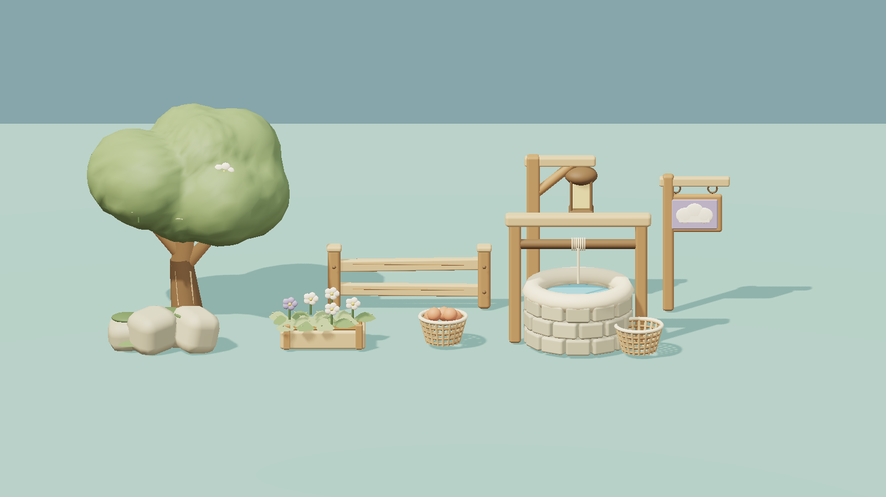
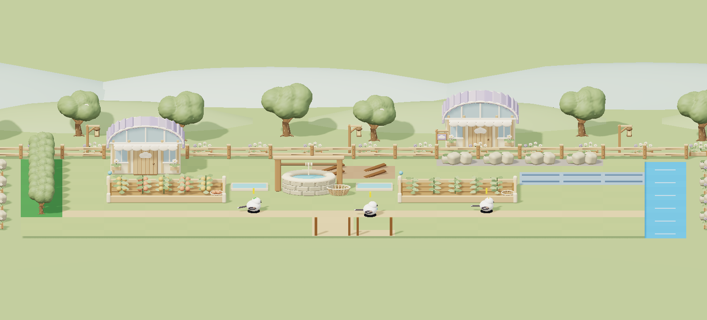

# Garden assets v1 — Cloud Greenhouse

사용자가 대화에서 사용한 **C / CLOUD GREENHOUSE** 원안에 맞춘 Godot 3D 에셋이다. 크림색 목재, 세이지색 수관, 연보라 지붕, 둥근 처마, 흰 꽃과 구름 표식을 공통으로 쓴다.



## 실제 게임 연결

`VillageStage3D`가 이 에셋을 배경·숲/암반 작업 구역·설치 건물·설치 미리보기에 사용한다. 별도 프로그램, 외부 모델 다운로드, Blender 설치가 필요 없다.

`scenes/*.tscn`을 Godot 장면으로 끌어 넣어 개별 소품으로도 사용할 수 있다. 메시 원본과 팔레트는 `garden_assets.gd`, 장면 생성은 `garden_prop.gd`에 있다. 종류/변형별 메시를 한 번 만들어 공유하며 각 소품은 정점 색을 가진 단일 메시와 무광 재질을 사용한다. 파일을 바꾸면 Godot 재실행으로 새 메시를 확인할 수 있다.

| 분류 | 에셋 |
| --- | --- |
| 자연 | `tree`, `flower_tree`, `rock` |
| 정원 소품 | `fence`, `planter`, `lantern`, `cloud_sign`, `basket` |
| 농사 | `well`, `farm_0`~`farm_3` (빈 밭/싹/성장/열매) |
| 건물 | `cottage`, `greenhouse`, `shed`, `lumber`, `quarry` |
| 시설 | `road`, `repair`, `training`, `dam`, `wheel` |

총 23개 장면. 나무는 겹친 구를 그대로 노출하지 않고, 잎 덩어리를 합친 연속 표면과 작은 표면 요철로 수관을 만든다. 줄기와 가지·뿌리·나뭇결, 둥글게 깎은 목재, 꽃잎·잎맥, 바구니 살대, 돌 우물의 테두리와 밧줄을 포함한다.

## 동작과 표시 계약

- 장식에는 충돌체·생산·정돈 작업이 없다. 이전에 제거한 부쉬 작업을 다시 만들지 않는다.
- 설치물은 기존 건물 ID·점유 크기·회전·생산 상태를 그대로 사용한다. 회전 후에도 압축된 마을 깊이 안에 들어가도록 모델을 맞춘다.
- 밭의 네 외형은 실제 생산 진행에 연결된다. 물 상태 표식도 실제 물망 결과로 표시한다.
- 공사 중과 설치 미리보기는 같은 메시를 반투명하게 쓴다. 캐릭터를 가리는 건물도 색을 보존한 채 옅어진다.
- 보는 기존 작동 물레를 유지한다. 기존 정령 모델과 전투 표시는 바꾸지 않는다.

## 검증과 미리보기

```sh
godot --headless --path game -s tests/run_garden_art_tests.gd
godot --headless --path game -s tests/run_village_tests.gd
```

`GARDEN_PREVIEW_DIR`를 기존 폴더로 지정하면 아트 검증이 실제 Godot 메시와 카메라, 물이 연결된 완성 예시 배치를 GLB로 내보낸다. 예시 배치는 사용자 저장에 쓰지 않는다.



위 그림은 **실제 게임 메시를 외부 3D 렌더러로 그린 검토 이미지**다. 게임 GUI 캡처가 아니며 렌더러의 조명·그림자는 Godot 화면과 조금 다르다. 원안의 회화적인 표면과 렌즈 흐림은 게임용 모델에서 단순화했다.
