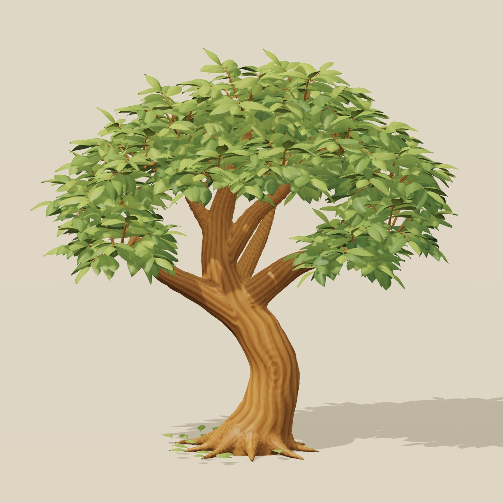
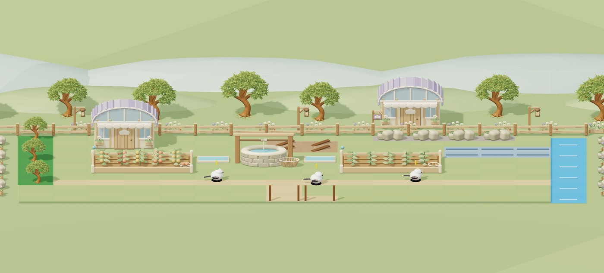
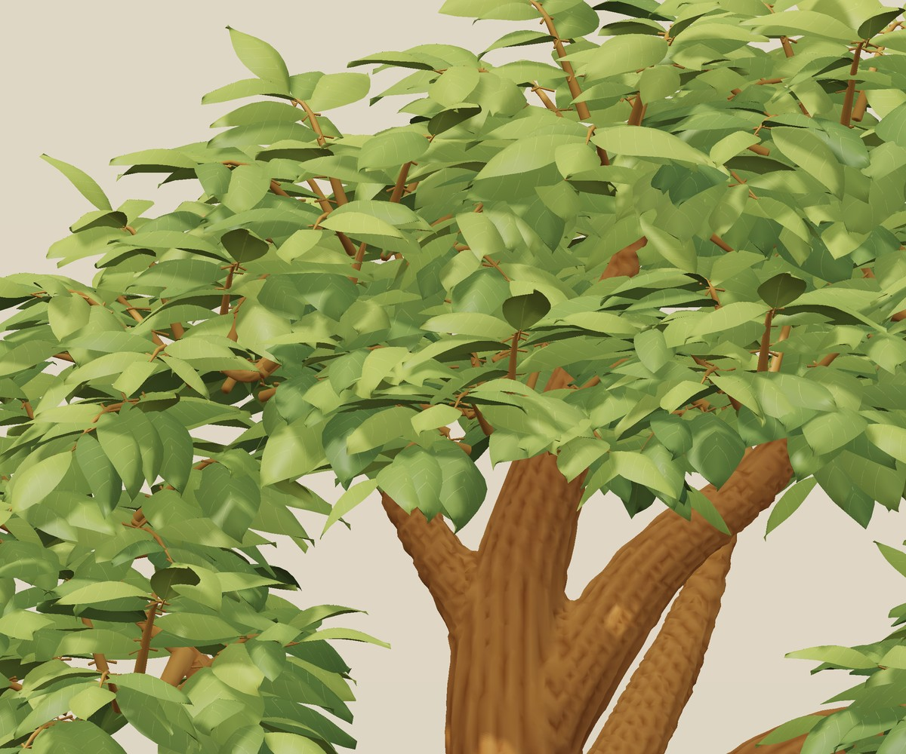

# Garden assets v1 — Cloud Greenhouse

사용자가 대화에서 사용한 **C / CLOUD GREENHOUSE** 원안에 맞춘 Godot 3D 에셋이다. 크림색 목재, 세이지색 수관, 연보라 지붕, 둥근 처마, 흰 꽃과 구름 표식을 공통으로 쓴다.



나무는 최신 단독 원안에 맞춰 교체했다. 아래 설명의 건물·소품은 이전 Cloud Greenhouse 작업을 유지한다.

## 실제 게임 연결

`VillageStage3D`가 이 에셋을 배경·숲/암반 작업 구역·설치 건물·설치 미리보기에 사용한다. 별도 프로그램, 외부 모델 다운로드, Blender 설치가 필요 없다.

`scenes/*.tscn`을 Godot 장면으로 끌어 넣어 개별 소품으로도 사용할 수 있다. 소품 원본과 팔레트는 `garden_assets.gd`, 새 나무의 잎·가는 가지는 `detailed_tree.gd`, 줄기 모델은 `models/tree_bark_*.res`, 장면 생성은 `garden_prop.gd`에 있다. 종류/변형별 메시를 한 번 만들어 공유하며 각 소품은 정점 색을 가진 단일 메시와 무광 재질을 사용한다. 파일을 바꾸면 Godot 재실행으로 새 메시를 확인할 수 있다.

| 분류 | 에셋 |
| --- | --- |
| 자연 | `tree`, `flower_tree`, `rock` |
| 정원 소품 | `fence`, `planter`, `lantern`, `cloud_sign`, `basket` |
| 농사 | `well`, `farm_0`~`farm_3` (빈 밭/싹/성장/열매) |
| 건물 | `cottage`, `greenhouse`, `shed`, `lumber`, `quarry` |
| 시설 | `road`, `repair`, `training`, `dam`, `wheel` |

총 23개 소품 장면과 나무 검토 장면 1개. 나무는 2026-09-13 승인된 나무 단독 콘셉트를 기준으로 다시 제작했다. 기존 덩어리 수관은 제거했고, 개별 잎 1,773장과 가지로 수관을 구성한다. `tree`와 과거 이름 `flower_tree` 모두 이 새 활엽수 메시를 공유한다. 줄기와 가지·뿌리·나뭇결, 둥글게 깎은 목재, 꽃잎·잎맥, 바구니 살대, 돌 우물의 테두리와 밧줄을 포함한다.

## 동작과 표시 계약

- 장식에는 충돌체·생산·정돈 작업이 없다. 이전에 제거한 부쉬 작업을 다시 만들지 않는다.
- 설치물은 기존 건물 ID·점유 크기·회전·생산 상태를 그대로 사용한다. 회전 후에도 압축된 마을 깊이 안에 들어가도록 모델을 맞춘다.
- 밭의 네 외형은 실제 생산 진행에 연결된다. 물 상태 표식도 실제 물망 결과로 표시한다.
- 공사 중과 설치 미리보기는 같은 메시를 반투명하게 쓴다. 캐릭터를 가리는 건물도 색을 보존한 채 옅어진다.
- 보는 기존 작동 물레를 유지한다. 기존 정령 모델과 전투 표시는 바꾸지 않는다.

## 검증과 미리보기

```sh
godot --headless --path game -s tests/run_garden_art_tests.gd
godot --headless --path game -s tests/run_village_tests.gd
```

`GARDEN_PREVIEW_DIR`를 기존 폴더로 지정하면 아트 검증이 실제 Godot 메시와 카메라, 물이 연결된 완성 예시 배치를 GLB로 내보낸다. 예시 배치는 사용자 저장에 쓰지 않는다.



위 그림은 **실제 게임 메시를 외부 3D 렌더러로 그린 검토 이미지**다. 게임 GUI 캡처가 아니며 렌더러의 조명·그림자는 Godot 화면과 조금 다르다. 원안의 회화적인 표면과 렌즈 흐림은 게임용 모델에서 단순화했다.

## 새 나무를 따로 확인하기

`scenes/tree_review.tscn`을 열고 **F6**을 누른다. 마우스 왼쪽 드래그로 회전하고 휠로 확대·축소한다. 실제 마을과 동일한 `GardenAssets.make("tree")`를 사용한다. 저장 데이터는 건드리지 않는다.

- 줄기·굵은 가지·뿌리: 연결부를 먼저 합친 연속 표면. 굴곡, 수피의 홈과 옹이 무늬를 포함한다.
- 잎: 개별 곡면, 말린 가장자리, 잎맥, 잎자루, 녹색 변화. 양면 불투명 재질로 앞뒤가 보인다.
- 가까운 거리: 371,380삼각형. 거리별 LOD: 133,798삼각형. 잎 수를 유지하며 잔 잎맥과 작은 면을 줄인다.
- 3개 변형을 종류별로 한 번 생성해 공유한다. 잎을 개별 Node로 만들지 않는다. 검사 환경에서 3종 초기 생성은 약 5.5초, 이후 인스턴스는 캐시를 재사용한다. 실제 게임 FPS 측정치는 아니다.
- [Godot ArrayMesh LOD](https://docs.godotengine.org/en/stable/classes/class_arraymesh.html#class-arraymesh-method-add-surface-from-arrays)를 사용한다. 검토 장면과 일반 마을의 화면 크기에 따라 엔진이 세부 수준을 선택한다.

```sh
godot --headless --path game -s tests/run_tree_art_tests.gd
# Existing output directory; exports actual scene geometry, not a concept image.
TREE_PREVIEW_DIR=/tmp/tree-review godot --headless --path game -s tests/run_tree_art_tests.gd
```

개발용 원본 재생성은 `source/sculpt_tree_bark.py`(NumPy/SciPy/scikit-image), 검토 렌더는 `source/render_tree.py`(NumPy/Pillow/ModernGL)를 사용한다. 게임 실행에는 Python이나 Blender가 필요 없다. 제작용 줄기 GLB를 재생성한 뒤 Godot에서 가져오고 `source/pack_tree_bark.gd`로 작은 네이티브 리소스를 생성한다. 나무 캐시를 재생성하려면 게임을 재시작한다.

```sh
python game/assets/garden_v1/source/sculpt_tree_bark.py
godot --headless --path game --editor --import --quit
godot --headless --path game -s assets/garden_v1/source/pack_tree_bark.gd
python game/assets/garden_v1/source/render_tree.py --export-dir /tmp/tree-review --output-dir /tmp/tree-review
```



### 파일 전송 수정

줄기를 약 124~158KB의 Godot `.res` 7개로 저장한다. 런타임에는 원래처럼 단일 메시로 합친다. 기존 GLB 대비 모든 삼각형 위치와 색이 같고, 법선 재패킹의 최대 차이는 0.000126이다. 제작용 GLB는 Python 원본으로 재생성하며 Git에 중복 저장하지 않는다. 검토 이미지는 같은 해상도의 JPEG로 압축했다. 큰 바이너리를 한 번에 긴 텍스트로 보내던 경로를 없애 전송 한 건의 크기를 제한했다.
